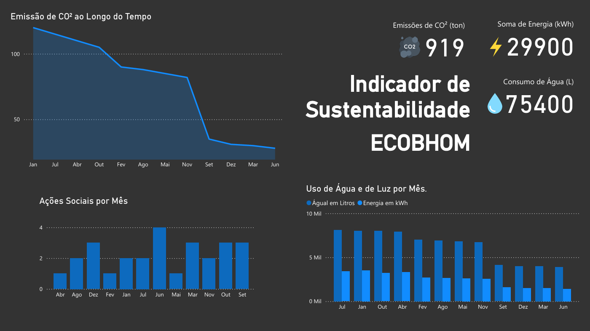

# 🌱 Dashboard ESG - Indicadores de Sustentabilidade

> ⚠️ **ATENÇÃO:** Este projeto ainda está em construção. Atualizações e melhorias estão em andamento.

Este projeto consiste em um dashboard interativo desenvolvido no **Power BI**, com foco em **indicadores de sustentabilidade (ESG)**. A proposta é apresentar, de forma visual e dinâmica, os principais dados relacionados a iniciativas ambientais, sociais e de governança corporativa.

O objetivo é facilitar a análise e o acompanhamento de metas sustentáveis para auxiliar na tomada de decisões estratégicas.

---

## 🗂️ Estrutura do Projeto

- `Indicador de Sustentabilidade - Projeto.pbix`: Arquivo do Power BI com modelo e visualizações  
- `indicadores_esg.xlsx`: Base de dados fictícia utilizada  
- `Indicador de Sustentabilidade - Projeto.pdf`: Versão exportada do dashboard em PDF  
- `screenshot.png`: Captura de tela do dashboard

---

## 📊 Principais Indicadores

O dashboard contém filtros dinâmicos e seções organizadas por categoria ESG:

### 🌍 Ambiental (Environmental)
- Emissão de CO₂ por setor
- Consumo de energia renovável
- Redução de resíduos

### 👥 Social
- Satisfação de colaboradores
- Diversidade no quadro de funcionários
- Projetos sociais apoiados

### 🏛️ Governança
- Presença de políticas de transparência
- Participação feminina na liderança
- Indicadores de compliance

---

## 🖱️ Funcionalidades

- Filtros por período, área da empresa e tipo de indicador  
- Cartões com valores-chave (KPIs)  
- Gráficos de barras, linhas e segmentações interativas  
- Informações contextuais explicando cada métrica  
- Layout intuitivo e responsivo

---

## 📌 Visual do Dashboard

---

## 🔄 Próximos Passos

- Conectar a uma fonte de dados real (MySQL, Excel online ou API)  
- Adicionar comparação de metas versus realizado  
- Inserir navegação entre páginas e relatórios adicionais  
- Traduzir para inglês para uso internacional
- Formatação de cartões e fundo.

---

## 👨‍💻 Desenvolvido por

**Vyttor Mendes**  
📧 vyector@gmail.com  
